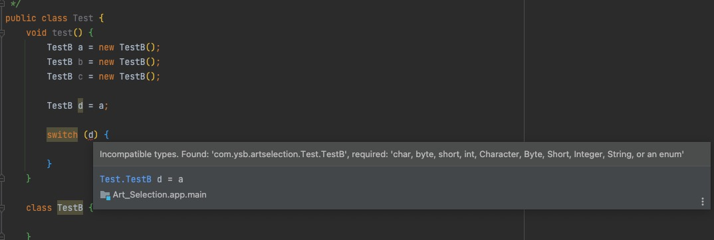
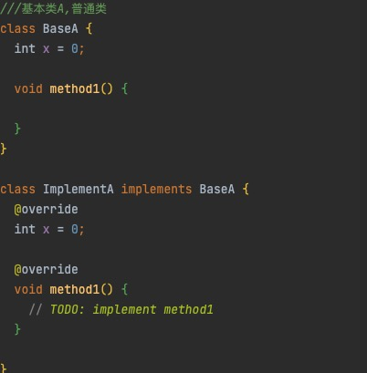
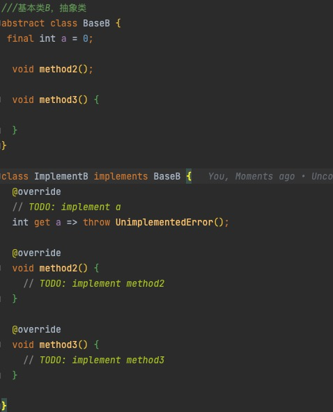
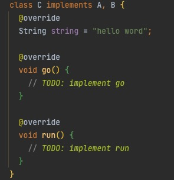
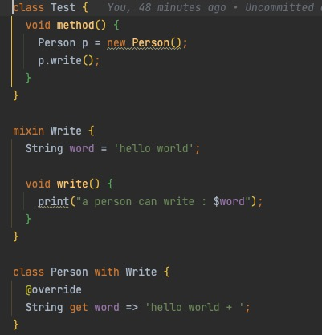
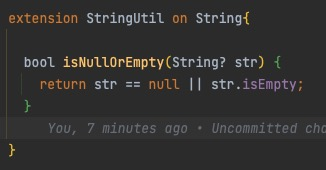
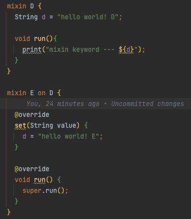

# study for flutter
《Flutter实战》第二版学习记录
https://book.flutterchina.club/

#Dart语法学习
##与Java&Kotlin区别：
>1.基本数据类型

|  类型   |        Dart        |          Java           |       Kotlin       |
|:-----:|:------------------:|:-----------------------:|:------------------:|
|  布尔   |        bool        |         boolean         |      Boolean       |
|  数值   | num (int / double) | int / double / long ... | Int/Double/Long... |
|  字符串  |       String       |         String          |       String       |
    
    

    其中需要注意，Dart中num 同样可以作为数据类型使用，如:
    num a = 10; (整数型)
    num b = 10.0; （浮点型）  
    
    int c = 10; (整数型)
    double d = 10.00; （浮点型）

>num 在Dart 中为抽象类，具有int 及 double 两个实现类，使用num 为类型定义变量时,会进行变量类型推断，推断为对应的实现类（int / double）。    
    
    字符串定义:
    //单引号定义字符串
    String e = 'hello world';
    String g = '''hello world''';

    //双引号定义字符串
    String f = "hello world";
    String h = """hello world""";

>其中使用''' 与 """ 时，会跟随文本换行，而"" 与 '' 不会，"" 与 ''主动换行需要借助 \n 换行符。单引号定义的字符串中可以包含双引号，双引号定义的字符串中可以包含单引号，
同类引号中无法包含同类引号，如：
    
    错误使用：
    String a = "----"hello world"----";
    String b = '----'hello world'----';

    正确使用：
    String a = '----"hello world"----';
    String b = "----'hello world'----";

>Dart 支持 Kotlin 字符串拼接方式

    String name = "Child";
    
    String s = "$name, hello world, ${name}"

>语法区别

1.dart构造函数
    
    Class TestA {
        int a = 0;
        int b = 0;
        ///与Java相同的基本写法
        TestA(int a, int b) {
            this.a = a;
            this.b = b;
        }
        
        ///Dart 特有构造写法
        TestA(this.a, this.b);
        
        TestA(int x, int y)
            : this.a = x,
              this.b = y;
        ///命名构造，与Kotlin中的扩展函数类似，但实现但功能完全不同。
        TestA.instance(this.a, this.b);
    }

>关键字区别

1.Dart的类，方法，变量只有两种访问类型，及可见/不可见： 
* 在类名，方法名，变量名前添加_(下划线)，即为外部类不可见；没有 _ (下划线)为可见
* 没有访问范围控制关键字，public, private, protect。

2.interface & implement 关键字使用区别：
* Dart中, 没有interface 接口关键字的定义，但是有implement。
* implement 关键字使用，可以实现所有类：抽象类及普通类，需要实现类中所有定义的变量及方法,如下图所示

与Java & Kotlin相同，一个类可以实现多个（接口）类。
* 二义性解决：

当 C 类实现 A 、B 接口，必须强制覆为 所有 成员变量提供 get 方法,这点解决了二义性问题。

3.with & mixin 关键字
with & mixin 为Dart实现混入（mixins）的关键字，混入是指将一个类的代码插入到另一个类中，以增强该类的功能，而不需要创建一个新的子类。
目的：实现类功能扩展（可以同时混入多个）。比如Java & Kotlin 可以通过内部类的形式，来扩展类功能。混入类，没有构造方法，无法实例化，这
是混入类与普通类最直接区别。

混入二义性解决：
* 如C 以先A ，后B顺序混入两个类，A, B 中都含有一个变量名name的字符串，混入C后，打印字符串name，显示的为后混入B类中name的值。
即混入多个类时，若定义的相同类型&相同名称的变量，值为最后混入的类的值。
* 若变量名相同，但变量类型不同，同时混入会报错

4. extension 拓展/扩展方法关键字
* 这个功能与Kotlin的扩展方法是类似的，都可以在不修改类文件的前提下，扩展类方法。
* Kotlin不仅可以添加扩展方法，同时可以添加扩展变量。Dart只可以添加拓展方法。

5.on 关键字。
* on关键字用于混入类间，实现类似extends的关系。即混入类也可以通过on 关键字 引入其他混入类的功能。例如：

* on 与 extension配合使用，表示对哪个类进行扩展

    

